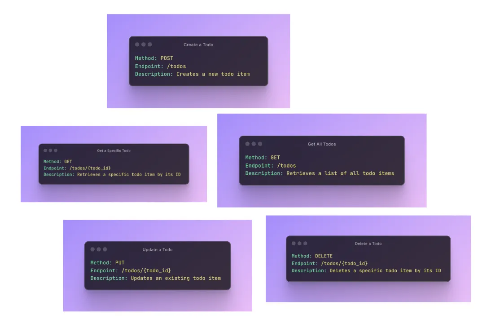
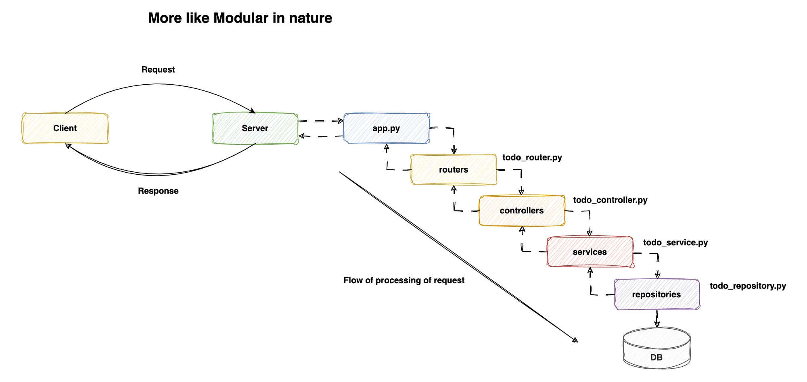
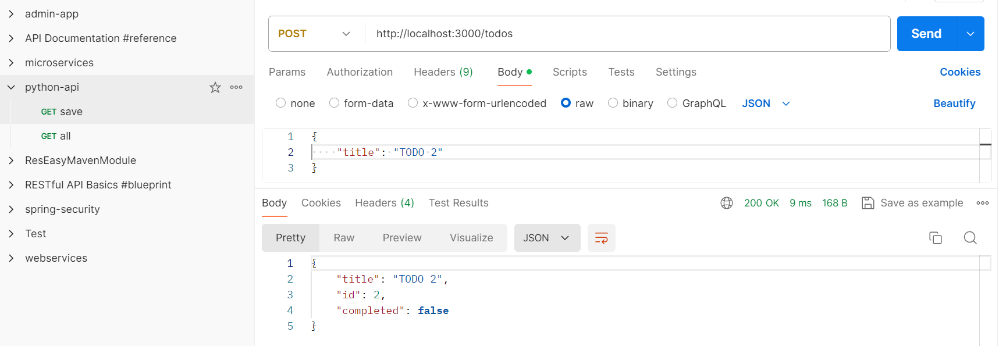
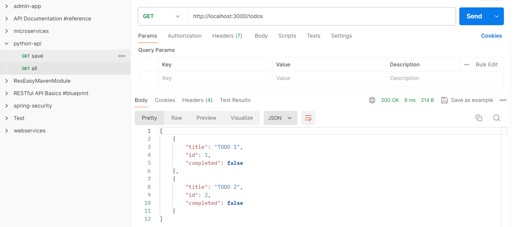

### Set up & Activate the virtual environment ###

Set up & Activate the virtual environment
```
python -m venv venv  #on Linux use python3 -m venv venv
```

```
cd venv\Scripts
activate.bat
python ..\..\app.py
```

### Install dependencies ###

```
pip3 install -r requirements.txt
```
### Concepton ###




### Architeture d'implementation ###



### Tests ###

POST http://localhost:3000/todos



GET http://localhost:3000/todos
